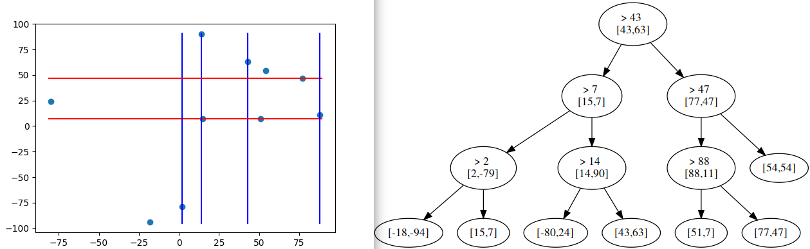
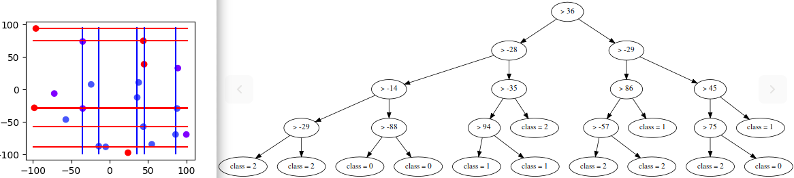
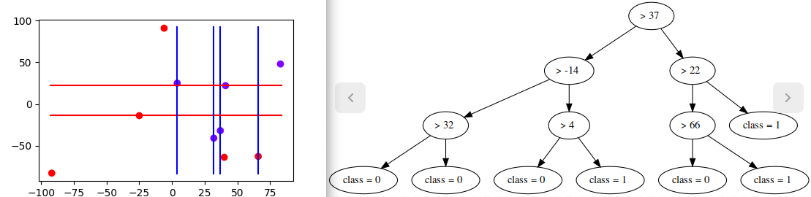

# kdtree

This repo has the content regarding the presentation of KD-Tree that will take place at 'Universidad Distrital'. The repository is composed by:
 - articles: contains some articles, slides of different universities regarding kdtree
 - implementation: my implementation of kdtree in different languages; more are comming...
 - proofs: some demonstrations to validate the efficiency of kdtree
 - simulation: show the process of construction of kdtree for oneclass and multiclass data
 - slides: presentation and code used in the slides

## Contest
Some real world problems to apply kdtrees

https://vjudge.net/contest/306898

## simulation
to read the instruction to run the  the simulation visit simulation// The script generate a view of s
 - Division of space
 - Tree representation
  - N number of random data
  - C number of types

 I have tested the simulation  1 <= N  <= 100000, building the assets under a second, you can do it with N greater, but will take more than a second in a conventional machine.

Here some examples

#### One class, N = 10, C = 1

#### Multi class, N = 20, C = 3

#### Multi class, N = 10, C = 2

## License
 - GPL V3

## Contributions

Maybe there are some bugs or stuff to improve that I have not discovered yet, I shall  appreciate your pull request or comments.
