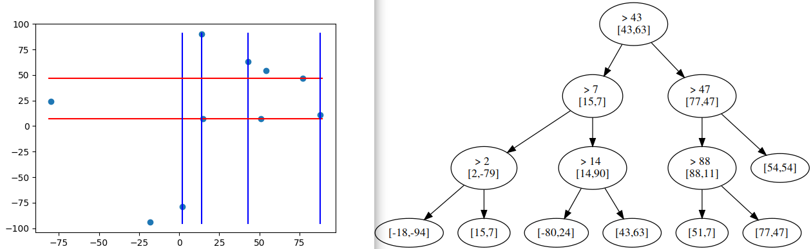
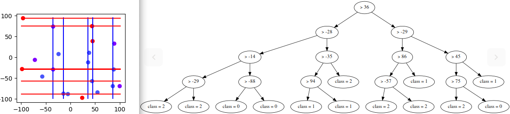

# Simulation

Here is the way to execute the Simulation, the code run under my implementation of kdtree in c++ to see the it visit /implementations/c++/t.cpp


## One class

```sh
  $ ./run.sh  N
```
- N is the number of random data that you want

#### One class, N = 10, C = 1


## Multi class

```sh
  $ ./run.sh  N C
```
- N is the number of random data that you want
- C is the number of classes that you want

#### Multi class, N = 20, C = 3


#### Multi class, N = 10, C = 2

